#

:::::: {.r-stack}
::: {.fragment data-fragment-index=1 .fade-out}
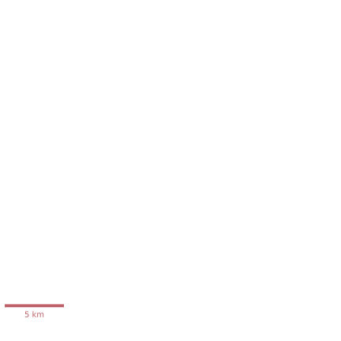{height=550}
:::
::: {.fragment data-fragment-index=1 .current-visible}
![37 data points from Weeplace checkins [@chen_2022_6369319]](figures/bud_05pct.svg){height=550}
:::
::: {.fragment data-fragment-index=2 .current-visible}
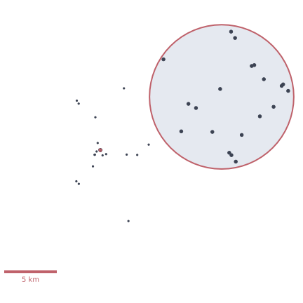{height=550}
:::
::: {.fragment data-fragment-index=3 .current-visible}
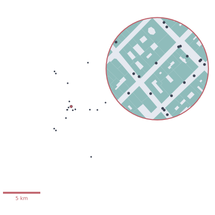{height=550}
:::
::: {.fragment data-fragment-index=4 .current-visible}
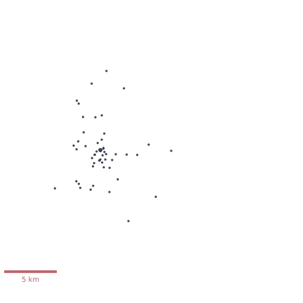{height=550}
:::
::: {.fragment data-fragment-index=5 .current-visible}
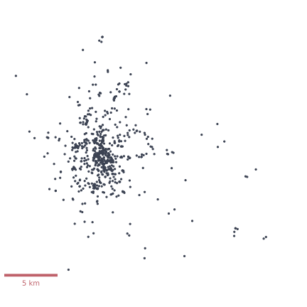{height=550}
:::
::: {.fragment data-fragment-index=6}
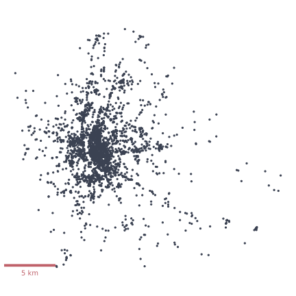{height=550}
:::
::::::

::: notes
- let's play game in which I show you maps, and you can guess the city
- 

:::

## human activity is tightly connected to the urban areas

- only ~700 data points and Budapest is almost recognizable
- ~3500 data points reveals the silhouette of the city
    - although the distribution is uneven

<!--::: {.r-fit-text}
human activity is tightly connected to the urban areas
:::-->

## {data-background-image="figures/nasa.jpg"}

::: {.text-color-light-shadowed .mt-8}
photo by NASA | NASA's Earth Observatory
:::

## {data-background-image="figures/central_europe.png"}

::: notes
mobile positioning data my not represent everyone, but we can clearly see the main hotspots of human activity
:::

<!--## {data-background-image="figures/central_europe_light.png"}

- some cities, regions are underrepresented
    - rural settlements
- some people may not represented in the data
- mobile positioning data may not represent everyone, but the hotsports of human activity are already
    - more and more data is collected
    -->

# YJMob100K

- data is from the Yahoo! Japan smartphone application
- published as open data in 2023 [@yabe_2024_10836269]
    - as a part of the HuMob Challenge 2023 [@yabe2023humob]
- follows 100,000 people
- during consecutive 75 days
    - not known which days
- in a 100 km by 100 km area
- *somewhere* in Japan

## data sample

|   uid |   d |   t |   x |   y |
|------:|----:|----:|----:|----:|
|     0 |   0 |   1 |  79 |  86 |
|     0 |   0 |   2 |  79 |  86 |
|     0 |   0 |   8 |  77 |  86 |
|     0 |   0 |   9 |  77 |  86 |
|     0 |   0 |  19 |  81 |  89 |

where d is day, t is time (0-47), x and y is the location in a 200 × 200 grid

## visualizing mobility data

:::::::::::: {.columns}
::::::::: {.column width="50%"}
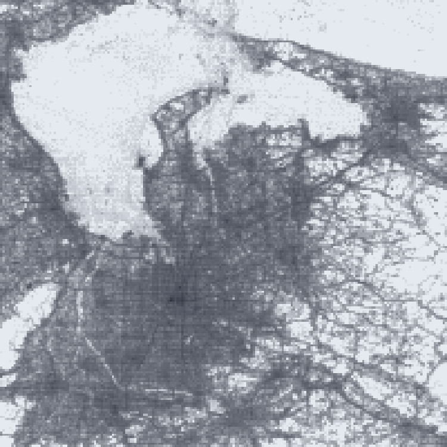{.frame}

:::::::::
::::::::: {.column width="50%"}
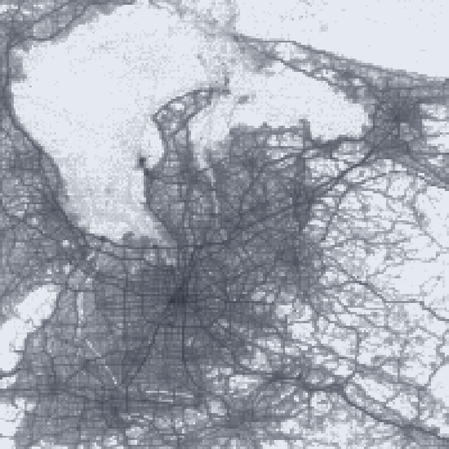{.frame data-preview-image="figures/user_heatmap_v2.png" data-preview-fit="contain"}

:::::::::
::::::::::::

::: {.text-smaller}
reproductions of figure 8 [@yabe2024yjmob100k]
:::

# finding out which city it is

1. Japan is an island country
2. the largest cities are on the shores
3. 100 km by 100 km observation area
4. some low activity part of the heatmap must be water

## finding out which city it is -- largest cities

:::::::::::: {.columns}
::::::::: {.column width="33%" .fragment}
{data-preview-image="figures/tokyo_and_yokohama_gamma-50.png" data-preview-fit="contain"}

:::::::::
::::::::: {.column width="33%" .fragment}
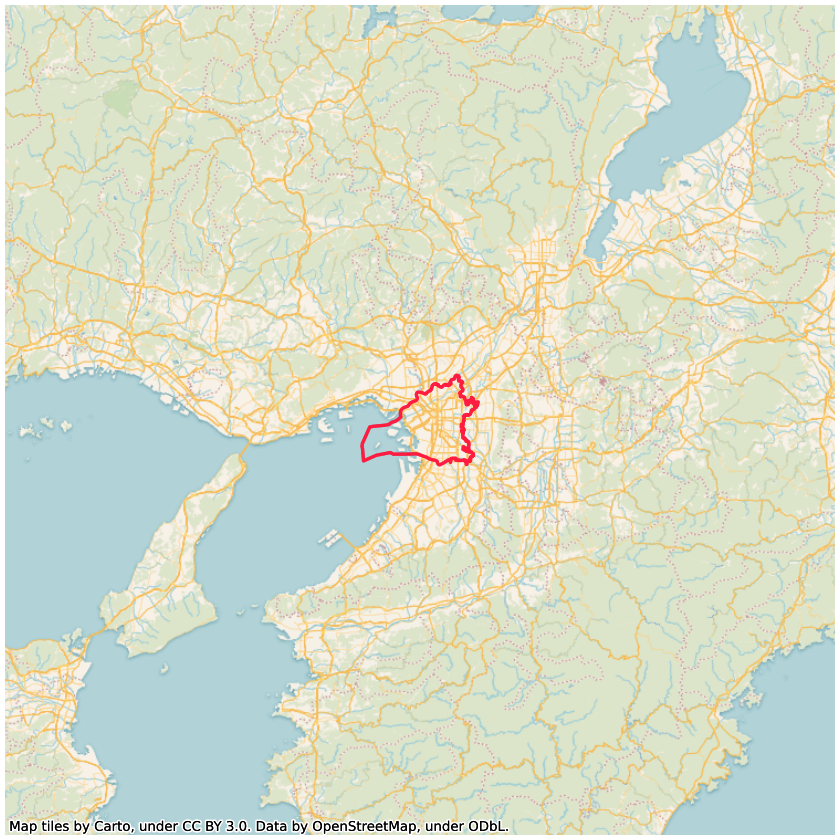{data-preview-image="figures/osaka_gamma-50.png" data-preview-fit="contain"}

:::::::::
::::::::: {.column width="33%" .fragment}
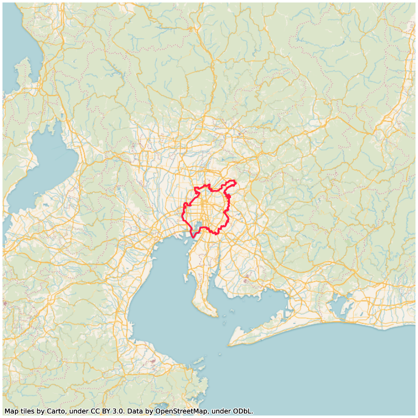{data-preview-image="figures/nagoya_gamma-50.png" data-preview-fit="contain"}

:::::::::
::::::::::::

## finding out which city it is -- Nagoya

:::::::::::: {.columns}
::::::::: {.column width="33%"}
{data-preview-image="figures/nagoya_gamma-50.png" data-preview-fit="contain"}

:::::::::
::::::::: {.column width="33%"}
:::::: {.r-stack}
::: {}

<!-- <i class="fa-solid"></i> -->
{width=48}
:::
::: {.fragment fragment-index=2 .current-visible}
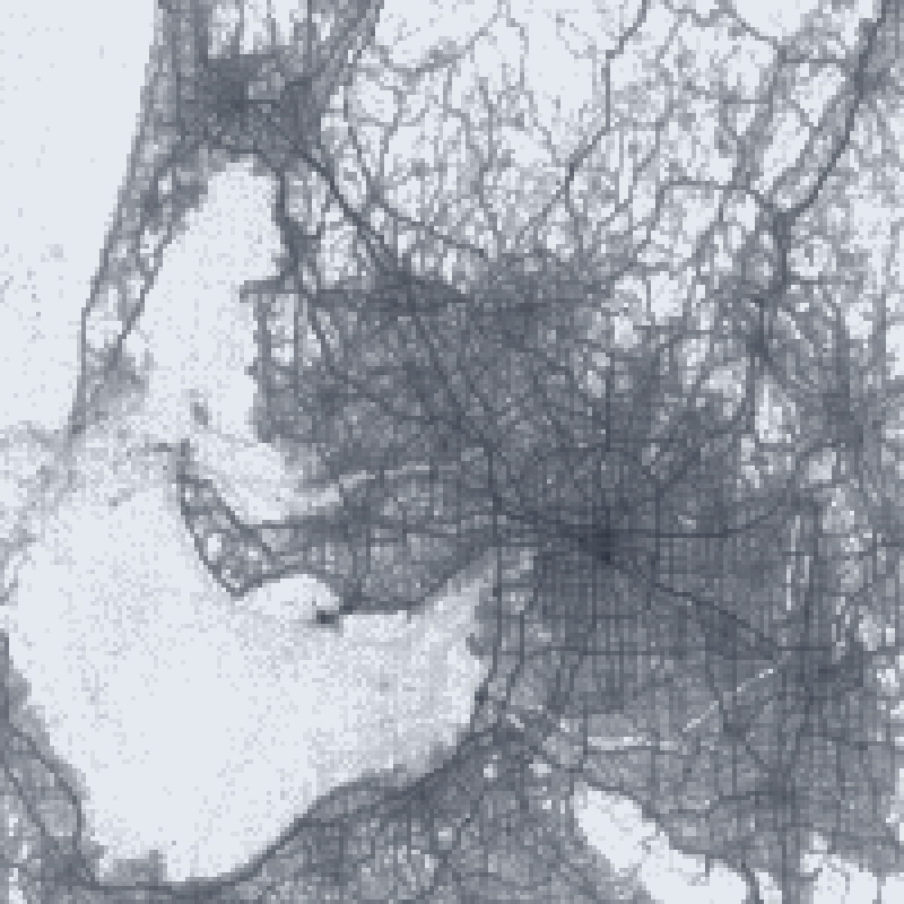

<!-- <i class="fa-solid fa-rotate-left"></i> -->
{width=48}
:::
::: {.fragment fragment-index=3}
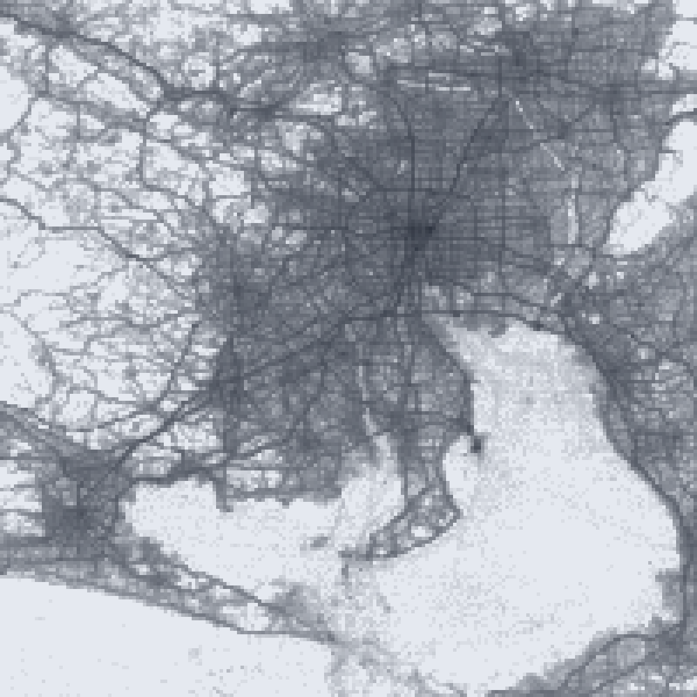

<!-- <i class="fa-solid fa-rotate-left"></i><i class="fa-solid fa-rotate-left"></i> -->
{width=48}
{width=48}
:::
::::::
:::::::::
::::::::: {.column width="33%" .fragment fragment-index=4}
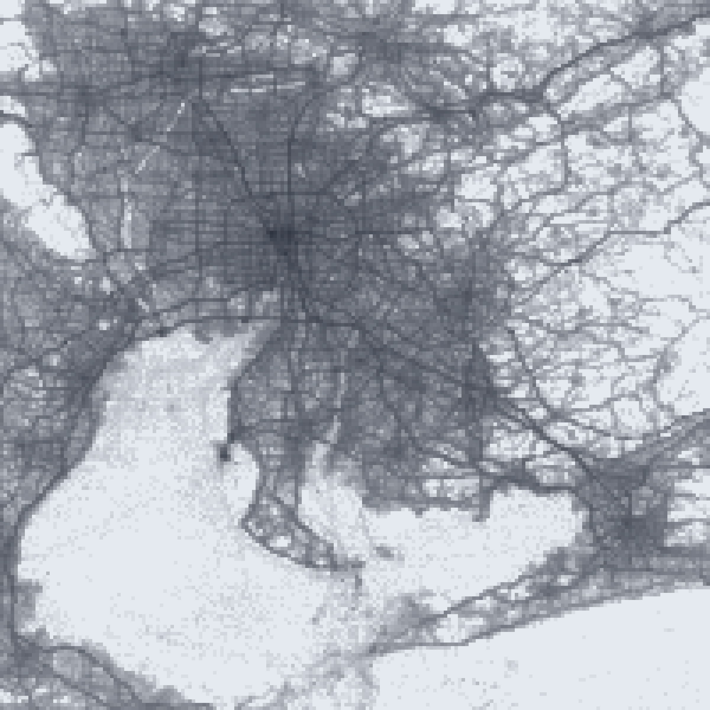

<!-- <i class="fa-solid fa-arrows-left-right"></i> -->
<!-- <i class="fa-solid fa-arrows-left-right-to-line"></i> -->
{width=48}
:::::::::
::::::::::::

::: {.fragment fragment-index=5}
[problem]{.text-color-aurora1}: the heatmap contains no geographic information
:::

# template matching

 by Laserlicht and Benjamin Watson | [CC BY 4.0](https://creativecommons.org/licenses/by/4.0/deed.en)](figures/Template_Matching.png){.frame}

## applying template matching to the problem

:::::::::::: {.columns}
::::::::: {.column width="60%"}
- a map is required where 1 pixel is 500

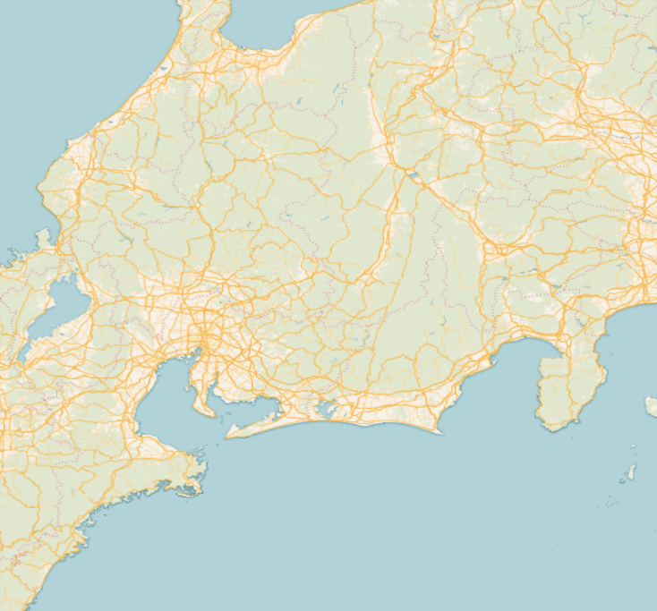

:::::::::
::::::::: {.column width="40%"}
- template: 200×200 image
- 1 pixel is 500 m

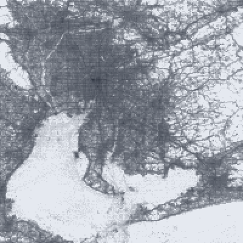{width=200}

:::::::::
::::::::::::

## preparing the template -- thresholding

:::::::::::: {.columns}
::::::::: {.column width="50%" .mt-1}
::::::: {.r-stack}
::: {.fragment .fade-out fragment-index=1}
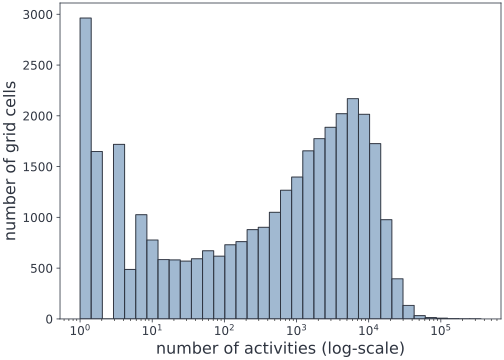

:::
::: {.fragment .current-visible fragment-index=1}

:::
:::::::
:::::::::
::::::::: {.column width="50%"}
::::::: {.r-stack}
::: {.fragment .fade-out fragment-index=1}

:::
::: {.fragment .current-visible fragment-index=1}
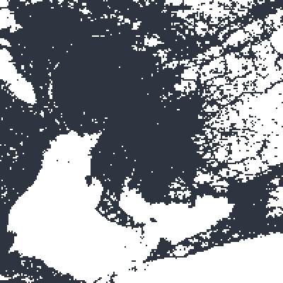
:::
:::::::
:::::::::
::::::::::::

## geolocating with template matching

:::::::::::: {.columns}
::::::::: {.column width="60%"}
:::::: {.r-stack}
::: {.fragment .fade-out fragment-index=1}
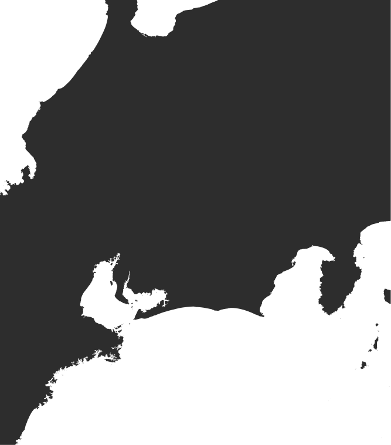{width=560}
:::
::: {.fragment .current-visible fragment-index=1}
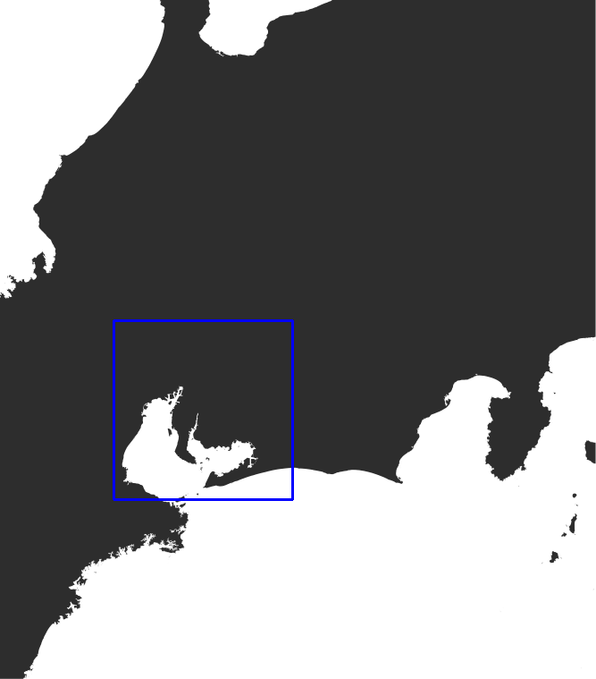{width=560}
:::
::: {.fragment .current-visible fragment-index=2}
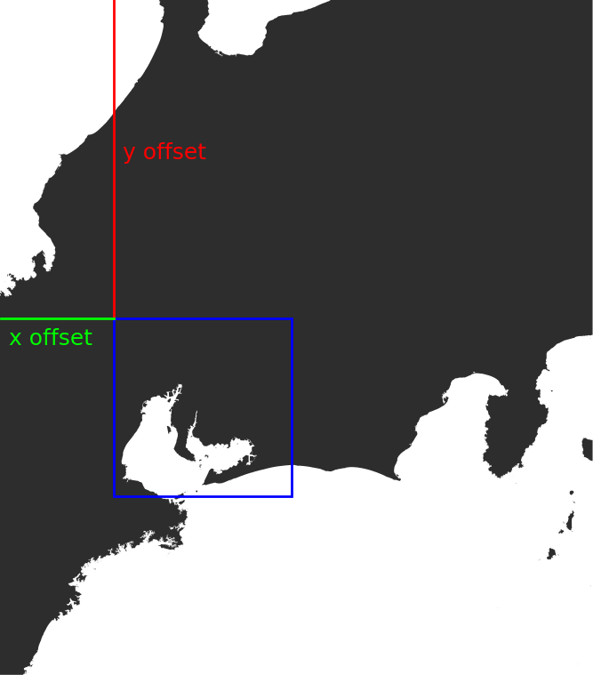{width=560}
:::
::: {.fragment .current-visible fragment-index=3}
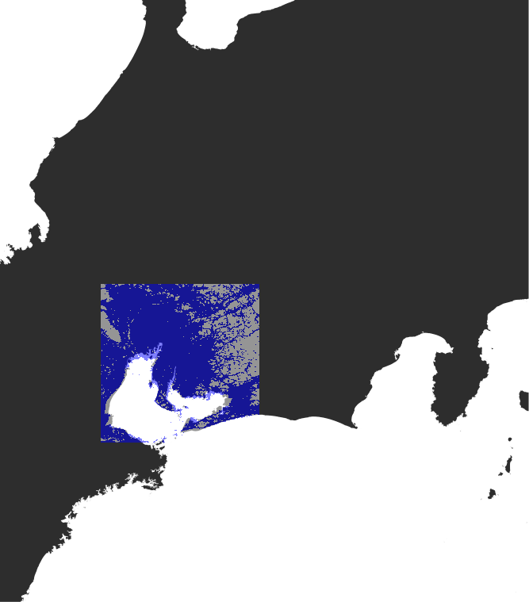{width=560}
:::
::::::
:::::::::
::::::::: {.column width="40%" .text-smaller}
{width=168}

::: {.fragment fragment-index=2}
- relative location: 127, 358
- absolute
    - [EPSG:2449](https://spatialreference.org/ref/epsg/2449/): -64000, -64000
    - [WGS84](https://spatialreference.org/ref/epsg/4326/): 136.4619, 35.42107
:::
:::::::::
::::::::::::

## verificating the geolocation

:::::::::::: {.columns}
::::::::: {.column width="50%"}

:::::::::
::::::::: {.column width="50%"}
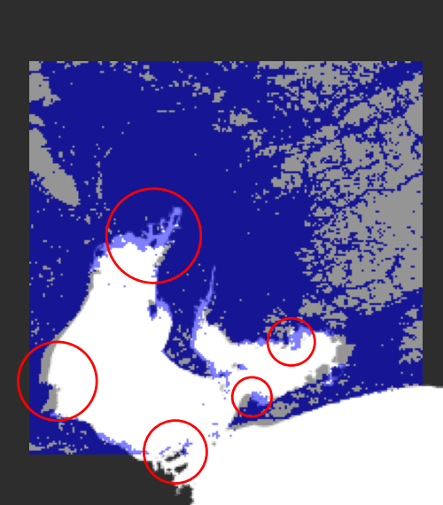

:::::::::
::::::::::::

## more transformation happened?

:::::::::::: {.columns}
::::::::: {.column width="55%"}
- the grid was rotated and mirrored
- what if a raster is not [exactly]{.text-color-aurora1} 500&nbsp;m&nbsp;×&nbsp;500&nbsp;m?
- because it was also shrunk or stretched

::: {.fragment}
template considers one pixel as one raster of the grid

it is difficult to shrink or stretch a pixel
:::

::: {.fragment}
the map can be shrunk and stretched [inversely]{.text-color-aurora1}

the value happened to be 10% shrink in width, 10% stretch in height
:::
:::::::::
::::::::: {.column width="45%" .fragment}
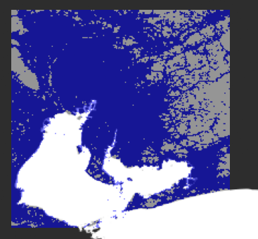{preview-image="figures/geolocating/unstretched/template_matched_zoomed.png" preview-fit="contain"}

a raster of a grid is actually 450&nbsp;m&nbsp;×&nbsp;550&nbsp;m
:::::::::
::::::::::::

## verification

:::::::::::: {.columns}
::::::::: {.column width="50%"}
{.frame}

:::::::::
::::::::: {.column width="50%" .mt-2 .fragment}
1. estimate user's home location
2. associate rasters to municipalities
3. sum the estimated inhabitants per municipalities
4. compare with census data [@estat2020population]

::: {.fragment}
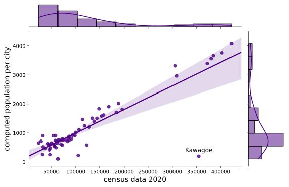{preview-image="figures/population_per_city.svg" preview-fit="contain"}
:::
:::::::::
::::::::::::

# robustness check -- thresholding

:::::::::::: {.columns}
::::::::: {.column width="25%"}
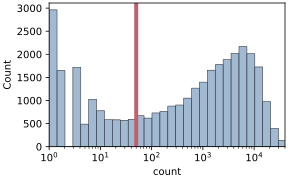{width=200}

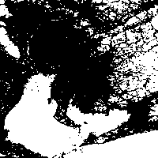{.frame}

:::::::::
::::::::: {.column width="25%"}
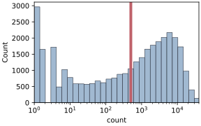{width=200}

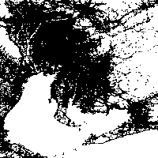{.frame}

:::::::::
::::::::: {.column width="25%"}
{width=200}

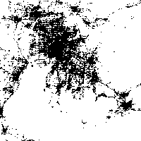{.frame}

:::::::::
::::::::: {.column width="25%"}
{width=200}

{.frame}

:::::::::
::::::::::::

::: notes
I've said that the threshold of 75 was selected arbitrarily.
Let me show that why that value has not too much impact on the geolocating.
:::

## anchor difference by threshold

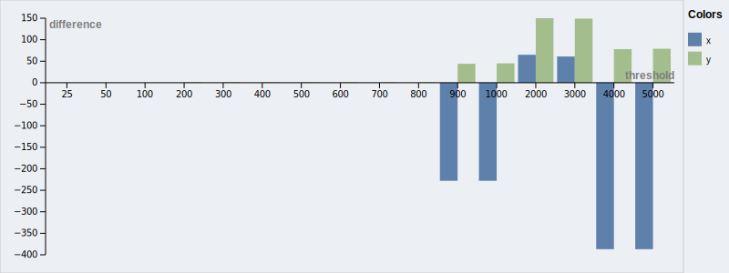

::: {.text-smaller .narrow-table}
|   |  [25]{preview-image="figures/threshold/activity_cut_400_25.png"}|  [50]{preview-image="figures/threshold/activity_cut_400_50.png"}| [100]{preview-image="figures/threshold/activity_cut_400_100.png"}| [200]{preview-image="figures/threshold/activity_cut_400_200.png"}| [300]{preview-image="figures/threshold/activity_cut_400_300.png"}| [400]{preview-image="figures/threshold/activity_cut_400_400.png"}| [500]{preview-image="figures/threshold/activity_cut_400_500.png"}| [600]{preview-image="figures/threshold/activity_cut_400_600.png"}| [700]{preview-image="figures/threshold/activity_cut_400_700.png"}| [800]{preview-image="figures/threshold/activity_cut_400_800.png"}| [900]{preview-image="figures/threshold/activity_cut_400_900.png"}| [1000]{preview-image="figures/threshold/activity_cut_400_1000.png"}| [2000]{preview-image="figures/threshold/activity_cut_400_2000.png"}| [3000]{preview-image="figures/threshold/activity_cut_400_3000.png"}| [4000]{preview-image="figures/threshold/activity_cut_400_4000.png"}| [5000]{preview-image="figures/threshold/activity_cut_400_5000.png"}|
|--:|---:|---:|---:|---:|---:|---:|---:|---:|---:|---:|---:|----:|----:|----:|----:|----:|
| x |  0 |  0 | 0  | 0  | 0  | 0  | 0  | 0  | 0  | 0  |-228| -228|  65 |  61 | -387| -387|
| y |  0 |  0 | 0  | 1  | 1  | 1  | 1  | 1  | 1  | 1  |  44|   45| 150 | 149 |   78|   79|

:::

## different cities, different data

:::::::::::: {.columns}
::::::::: {.column width="50%"}
{#toronto compare="figures/toronto/activity.png" before="OSM" after="MPD" start="100" width="475"}

Toronto
:::::::::
::::::::: {.column width="50%" .fragment}
{#london compare="figures/london/activity.png" before="OSM" after="MPD" start="100" width="475"}

London
:::::::::
::::::::::::

## different cities, different data

:::::::::::: {.columns}
::::::::: {.column width="50%"}
{#helsinki compare="figures/helsinki/activity.png" before="OSM" after="MPD" start="50" width="475"}

Helsinki
:::::::::
::::::::: {.column width="50%"}
{#dallas compare="figures/dallas/activity.png" before="OSM" after="MPD" start="50" width="475"}

Dallas--Fort Worth
:::::::::
::::::::::::

## different cities, different data -- results

:::::::::::: {.columns}
::::::::: {.column width="50%"}
:::::: {.r-stack}
::: {.fragment .fade-out fragment-index=2}
{.frame}
:::
::: {.fragment fragment-index=2}
{.frame}
:::
::::::
:::::::::
::::::::: {.column width="50%"}
:::::: {.r-stack}
::: {.fragment .current-visible fragment-index=1}
{.frame}
:::
::: {.fragment .current-visible fragment-index=2}
{.frame}
:::
::: {.fragment fragment-index=3}
{.frame}
:::
::::::
:::::::::
::::::::::::

## what did we learn so far?

1. human activity is closely linked to urban areas
2. even if the activity is transformed to a virtual plane (blind map) the city is geolocatable

::: {}
:::

<!-- 1. with enough location data, the geographic distribution of the activities will describe the urban area -->

# upscaling {visibility="hidden"}

:::::::::::: {.columns}
::::::::: {.column width="55%" .mt-2}
- spatial discretization of the mobility data is a 500 m × 500 m grid
- what if a coarser grid was used?
    - could it prevent the geolocation?

<!--
- simulate a 1 km × 1 km grid by summing 2×2 rasters
- simulate a 2 km × 2 km grid by summing 4×4 rasters
- simulate a 4 km × 4 km grid by summing 8×8 rasters
-->

<!--
- sum 2×2 rasters to simulate a 1 km × 1 km grid
- sum 4×4 rasters to simulate a 2 km × 2 km grid
- sum 8×8 rasters to simulate a 4 km × 4 km grid
-->

:::::::::
::::::::: {.column width="45%"}

:::::::::
::::::::::::

|merging|width (m)|resolution|
|:----:|----:|:-------:|
| --  |  500|200×200|
|2 × 2| 1000|100×100|
|4 × 4| 2000| 50×50 |
|8 × 8| 2000| 25×25 |

## upscaling

:::::::::::: {.columns}
::::::::: {.column width="55%" .mt-2}
- spatial discretization of the mobility data is a 500 m × 500 m grid
- what if a coarser grid was used?
    - could it prevent the geolocation?

:::::::::
::::::::: {.column width="45%"}

:::::::::
::::::::::::

:::::::::::: {.columns .fragment}
::::::::: {.column width="50%"}
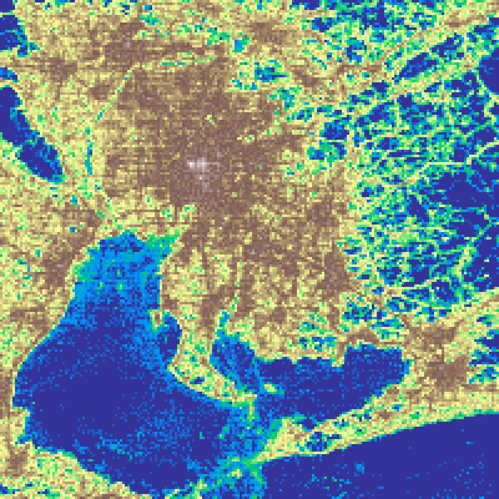{height=300}

:::::::::
::::::::: {.column width="50%"}
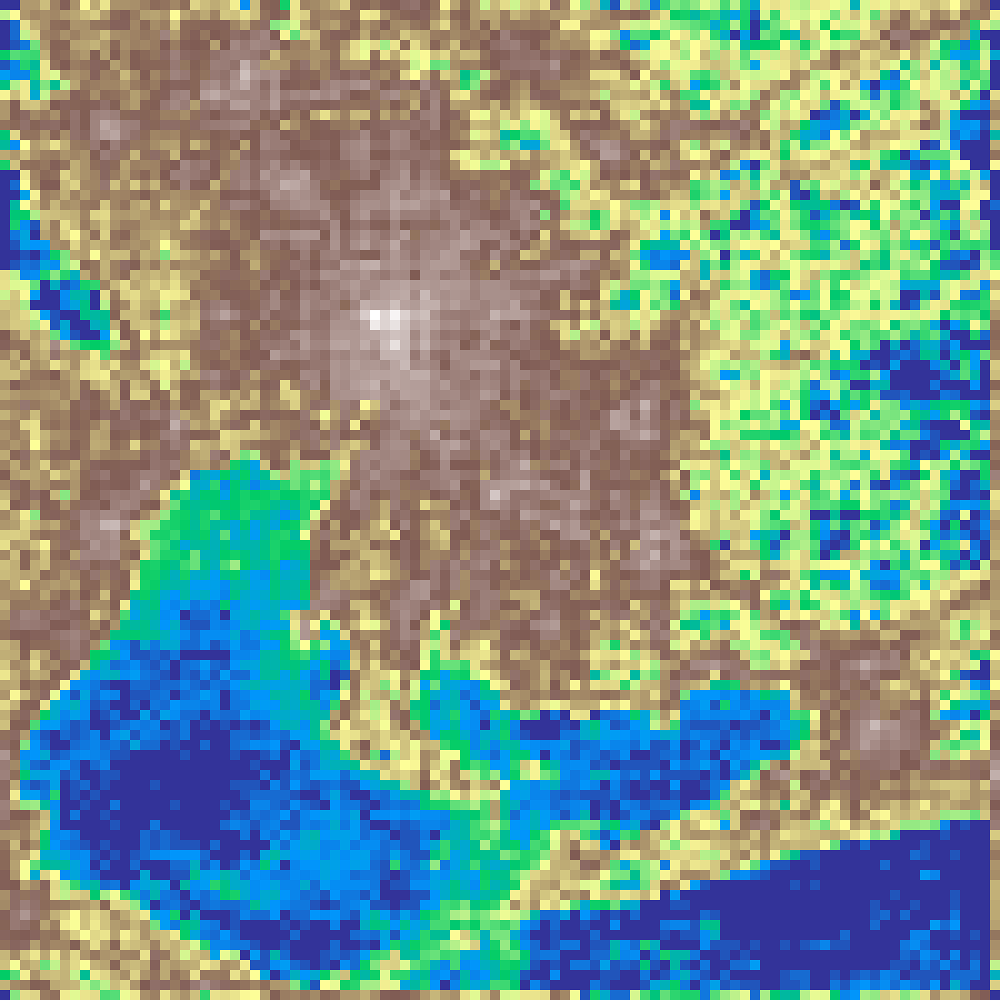{height=300}

:::::::::
::::::::::::

## upscaled geolocation

:::::::::::: {.columns}
::::::::: {.column width="33%"}
[100×100 pixel]{.text-smaller}

<!-- {height=100} -->
{height=100}

:::::::::
::::::::: {.column width="33%" .fragment fragment-index=1}
[50 × 50 pixel]{.text-smaller}

<!-- 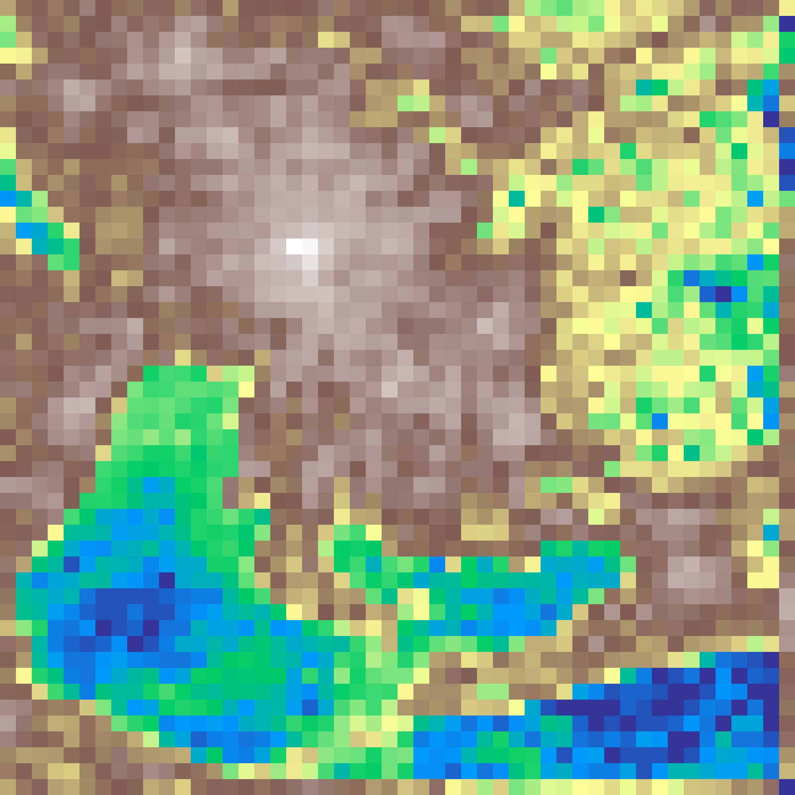{height=50} -->
{height=50}

:::::::::
::::::::: {.column width="33%" .fragment fragment-index=2}
[25 × 25 pixel]{.text-smaller}

:::::: {.r-stack}
<!-- 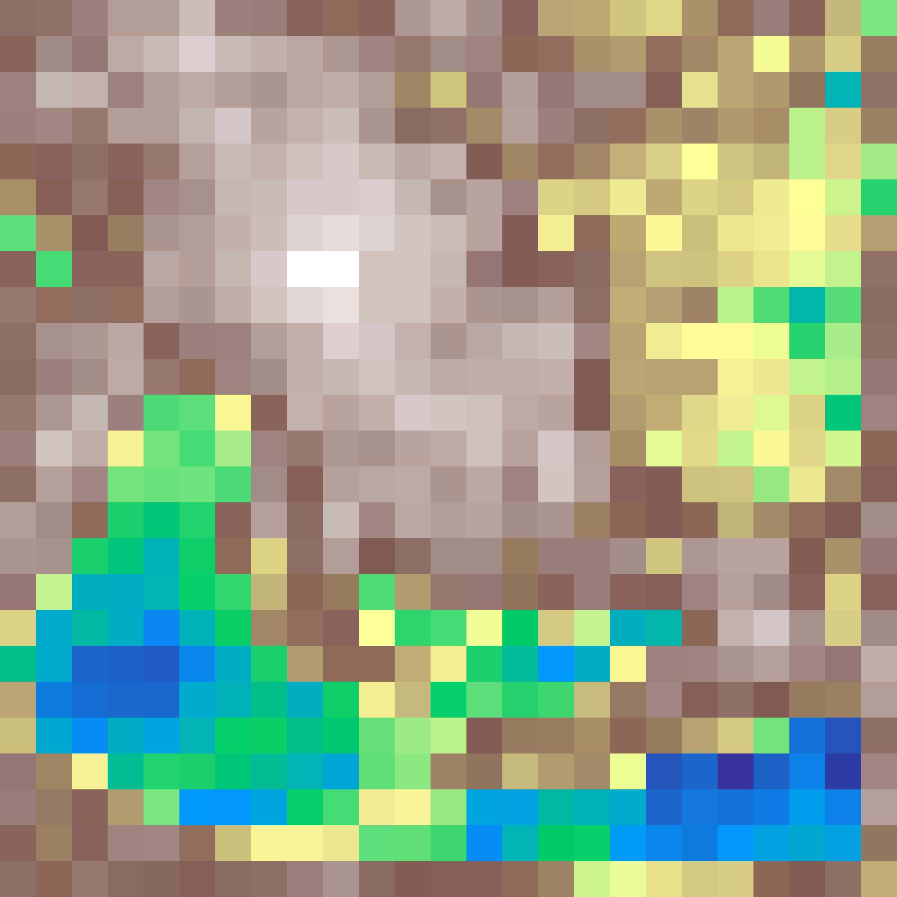{height=25} -->
::: {}
{height=25}
:::

::: {.fragment fragment-index=3 .current-visible}
{height=25}
:::

::: {.fragment fragment-index=4 .text-color-aurora1}
{height=25 preview-image="figures/upscaling/activity_binary_4000_4000_comparison_large.png" preview-fit="contain"}
:::
::::::
:::::::::
::::::::::::

:::::::::::: {.columns}
::::::::: {.column width="33%"}
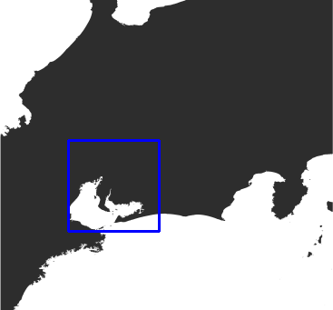

[1 km × 1 km discretization]{.text-smaller}

:::::::::
::::::::: {.column width="33%".fragment fragment-index=1}

[2 km × 2 km discretization]{.text-smaller}

:::::::::
::::::::: {.column width="33%" .r-stack .fragment fragment-index=2}
::: {}
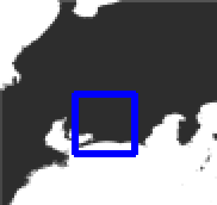

[4 km × 4 km discretization]{.text-smaller}

:::
::: {.fragment fragment-index=4}
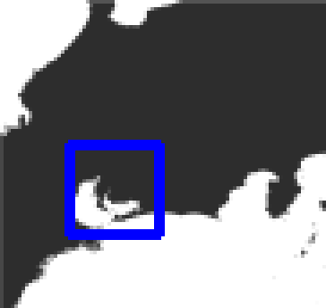

[4 km × 4 km discretization]{.text-smaller}

:::
:::::::::
::::::::::::

## why does upscaling even matter?

# privacy considerations

- location data is likely to lead to privacy risks [@zang2011anonymization]
    - must be coarse in either the time domain or the space domain
- even partial location data can be used to infer the location
    - like altitude information from fitness tracker applications [@meteriz2022learning]
- the top four locations is enough to stand out from the crowd [@de2013unique]
    - works almost like a fingerprint

## distinguishable by top four locations

:::::: {.r-stack}
::: {.fragment .fade-out fragment-index=1}
| location | 500 m × 500 m | 1 km × 1 km | 2 km × 2 km | 4 km × 4 km |
|---------:|--------------:|------------:|------------:|------------:|
|        4 |         99998 |
|        3 |             2 |
|        2 |             0 |
|        1 |             0 |

:::
::: {.fragment  fragment-index=1}
| location | 500 m × 500 m | 1 km × 1 km | 2 km × 2 km | 4 km × 4 km |
|---------:|--------------:|------------:|------------:|------------:|
|        4 |         99998 |       35469 |       12882 |        5090 |
|        3 |             2 |       48228 |       42323 |       28457 |
|        2 |             0 |       15582 |       38548 |       50987 |
|        1 |             0 |         721 |        6247 |       15466 |

:::
::::::

::: {.mt-3 .fragment fragment-index=2}
there's a trade-off between privacy preservation and researchers' interest of working with granular mobility data

distinguishing does not mean identifying[, but with additional information that could happen as well, espeally for famous people]{.fragment fragmen-index=3 .text-color-aurora1}
:::

## how could the privacy be preserved?

- exclude location information completely
- add noise to (a part of) the locations
- or add fake appearances

## adding noise

- Gaussian noise to every location
    - with standard deviation of 250, 500, 1000 (in the figure), 2000 meters

:::::::::::: {.columns}
::::::::: {.column width="50%"}
{width=350}

:::::::::
::::::::: {.column width="50%"}
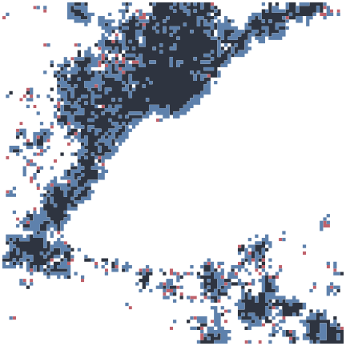{width=350 preview-image="figures/noise_as_blur.svg" preview-fit="contain"}

:::::::::
::::::::::::

## geolocating after noise addition

::: {.text-smaller}
Euclidean distance between the upper-left corner of the observation area and the result of the template matching operation (in meters)
:::

:::::::::::: {.columns}
::::::::: {.column width="50%"}
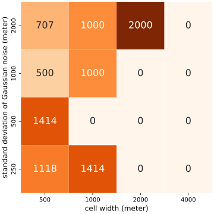

:::::::::
::::::::: {.column width="50%"}
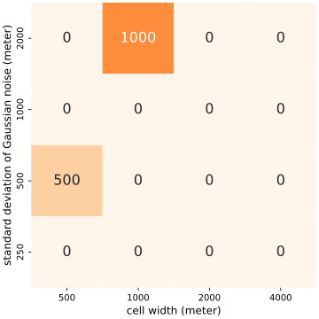

:::::::::
::::::::::::

## what did we learn so far?

1. human activity is closely linked to urban areas
2. even if the activity is transformed to a virtual plane (blind map) the city is geolocatable
    - even strong discretization
    - or noise addition

# observation period {background="#ebcb8b40"}

a follow-up study of Abhishek Kumar Mishra, Mathieu Cunche, and Héber&nbsp;H.&nbsp;Arcolezi inferred the observation period [@mishra2025breaking]

:::::: {.r-stack}
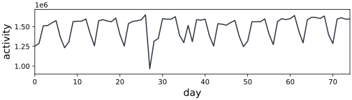{width=750}

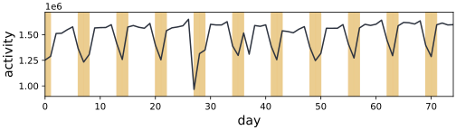{width=750 .fragment fragment-index=1}

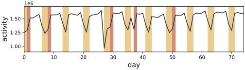{width=750 .fragment fragment-index=2}

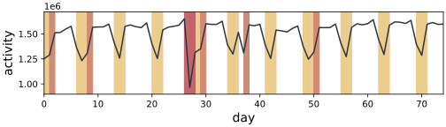{width=750 .fragment fragment-index=3}
::::::

- [daily activity shows the weekday--weekend differences [<svg width="40" height="24" xmlns="http://www.w3.org/2000/svg"><rect width="36" height="24" x="4" y="0" fill="#ebcb8b" /></svg> ]]{.fragment fragment-index=1}
- [holidays [<svg width="40" height="24" xmlns="http://www.w3.org/2000/svg"><rect width="36" height="24" x="4" y="0" fill="#d08770" /></svg> ]]{.fragment fragment-index=2}
    - [Respect for the Aged Day (16/09/2019), Autumn Equinox (23/09/2019), Health and Sports Day (14/10/2019), Enthronement Ceremony Day (22/10/2019), and Culture Day (04/11/2019)]{.text-smaller .fragment fragment-index=2}
- [typhoon Hagibis made landfall in Japan (12 October 2019) [<svg width="40" height="24" xmlns="http://www.w3.org/2000/svg"><rect width="36" height="24" x="4" y="0" fill="#bf616a" /></svg> ]]{.fragment fragment-index=3}

## observation period -- verification {background="#ebcb8b40"}

Port Messe Nagoya -- event center

:::::::::::: {.columns}
::::::::: {.column width="40%"}
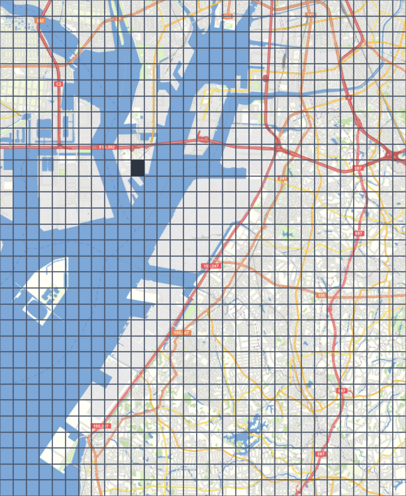

:::::::::
::::::::: {.column width="60%" .r-stack}
::: {}
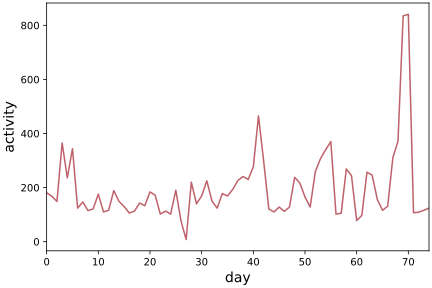

:::
::: {.fragment fragment-index=1}
![events collected by Mishra et al. [@mishra2025breaking]](figures/port_messe_nagoya_activity_label.svg)

:::
:::::::::
::::::::::::

::: {.fragment fragment-index=1}
*day 0* is 15 September 2019 [@mishra2025breaking]
:::

# takeaway

0. any data that describes human activity reflects the human behavior
    - contains a lot of implicit information
1. human activity is closely linked to urban areas
2. even if the activity is transformed to a virtual plane (blind map) the urban landscape is recognizable
    - obscuring the spatial dimension doesn't increase privacy
3. the temporal characteristic of human mobility data is also specific to the circadian rhythm
    - also the social / economic routine

# thanks for the attention! {background="#2e3440" .as-main-title }

::: {.text-color-snowstorm3}
Gergő Pintér[,]{.text-color-snowstorm1} gergo.pinter&ThinSpace;&#64;&ThinSpace;uni-corvinus.hu[,]{.text-color-snowstorm1} [\@]{.text-color-frost1}pintergreg[<i class="text-color-frost1 fa-brands fa-github"></i>](https://github.com/pintergreg) [<i class="text-color-frost1 fa-brands fa-bluesky"></i>](https://bsky.app/profile/pintergreg.bsky.social)
:::

::::::::::::::: {.columns .text-color-snowstorm3 .link-color}
:::::::::::: {.column width="50%"}
<!-- this presentation is available online: [pintergreg.github.io/geolocating_cities_using_human_activity_traces](https://pintergreg.github.io/geolocating_cities_using_human_activity_traces) -->
&nbsp; 
this presentation is available online:

[{width=350}](https://pintergreg.github.io/geolocating_cities_using_human_activity_traces)

::::::::::::
:::::::::::: {.column width="50%"}
read the paper: [Scientific Reports 14, 30948 (2024)](https://doi.org/10.1038/s41598-024-82006-5)

[{width=350}](https://doi.org/10.1038/s41598-024-82006-5)

::::::::::::
:::::::::::::::

# references {visibility=uncounted}

::: {#refs .text-size-1 .text-align-left}
:::

# other cities upscaled {visibility=uncounted}

:::::::::::: {.columns}
::::::::: {.column width="50%"}
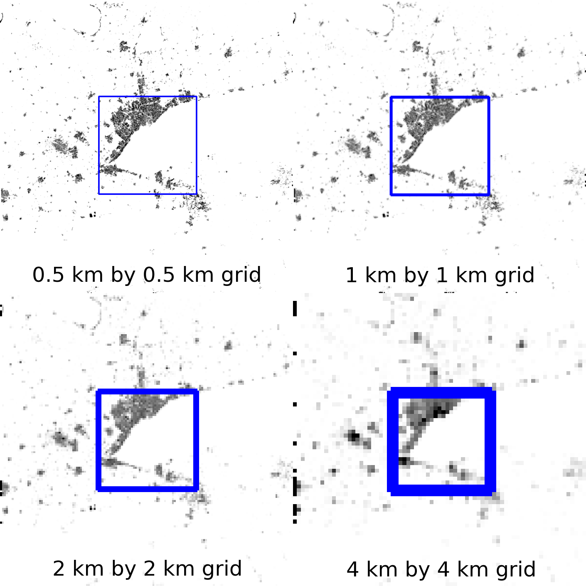{preview-image="figures/toronto/location_comparison.png" preview-fit="contains"}

:::::::::
::::::::: {.column width="50%"}
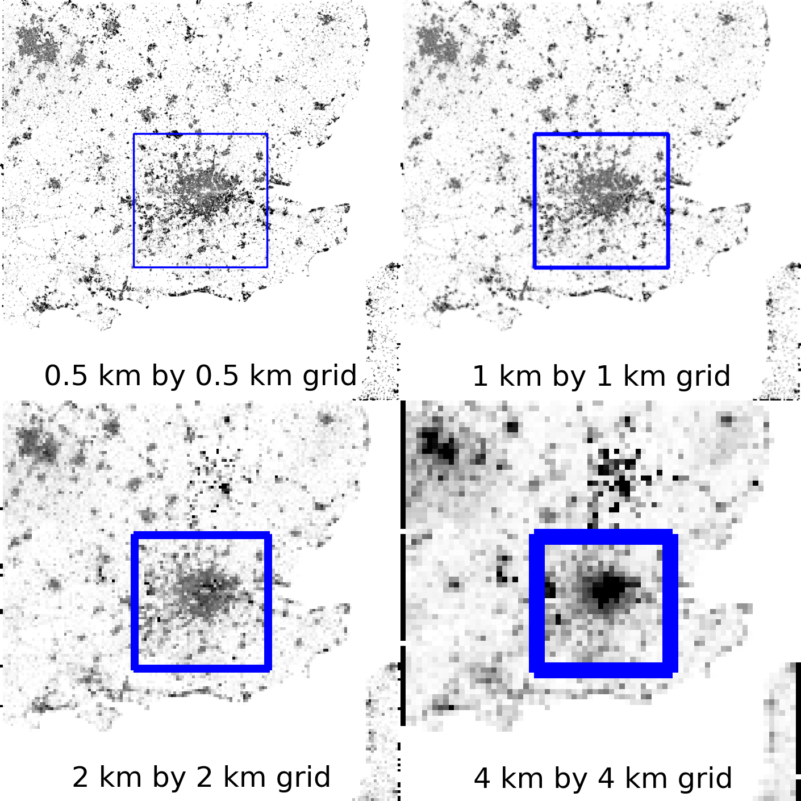{preview-image="figures/london/location_comparison.png" preview-fit="contains"}

:::::::::
::::::::::::

## other cities upscaled {visibility=uncounted}

:::::::::::: {.columns}
::::::::: {.column width="50%"}
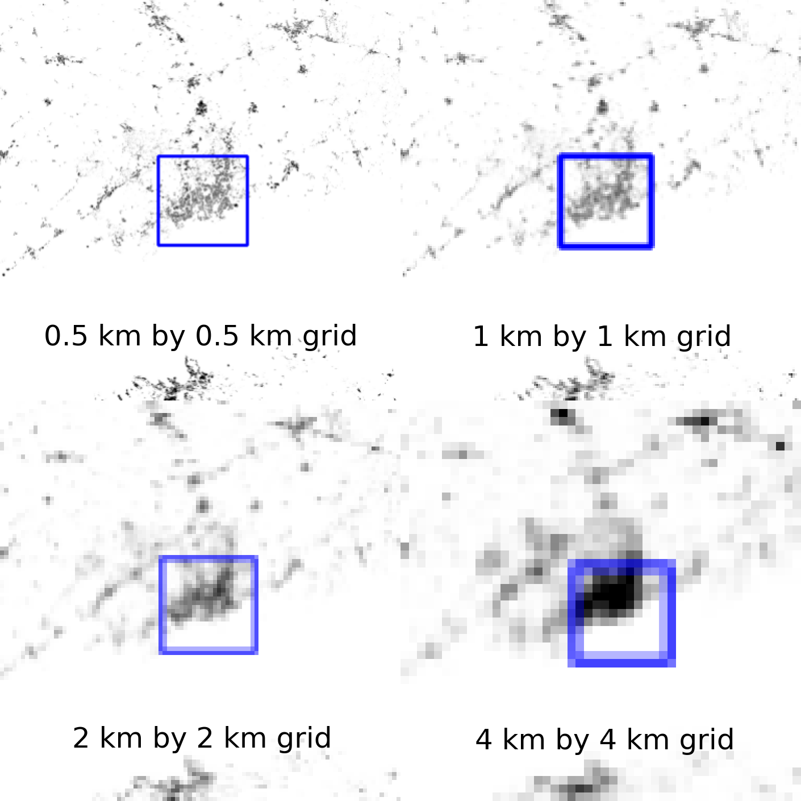{preview-image="figures/helsinki/location_comparison.png" preview-fit="contains"}

:::::::::
::::::::: {.column width="50%"}
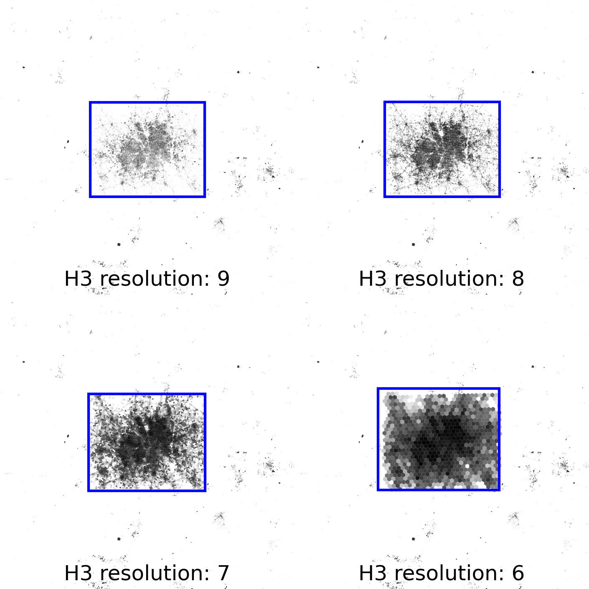{preview-image="figures/dallas/location_comparison.png" preview-fit="contains"}

:::::::::
::::::::::::
